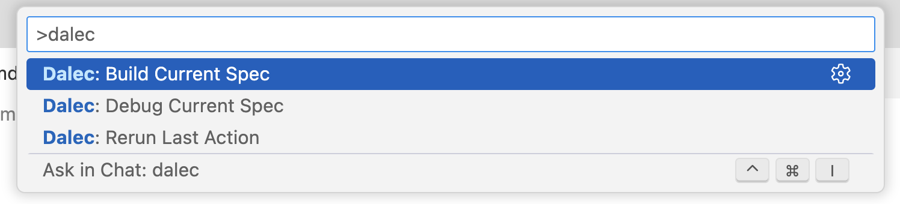
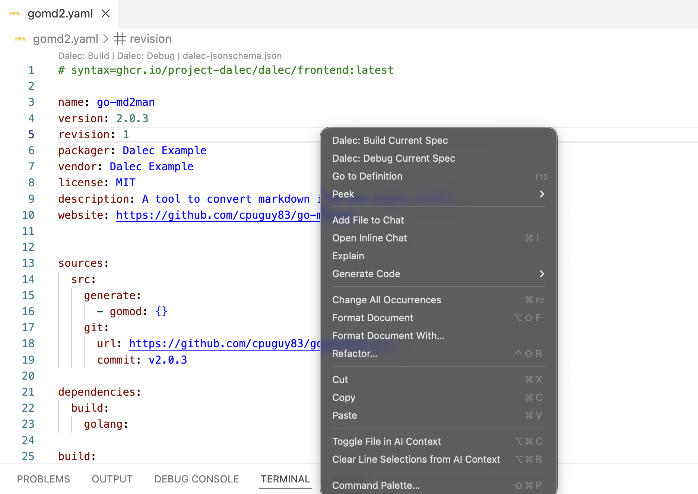

# Dalec VS Code Extension

VS Code extension for authoring and debugging Dalec specs.

> [!WARNING]
> **Early Development**: This extension is not production ready yet and may change significantly.

## Features

- 🔍 Auto-detects Dalec spec files (YAML with `#syntax=...` header)
- ✨ Schema-powered completions, hover, and validation via Red Hat YAML extension
- 🐛 BuildKit debugging support with `dalec-buildx` debug type
- ▶️ CodeLens actions for quick "Debug" and "Build" commands
- 🎯 Queries available targets from the Dalec frontend via `docker buildx build --call targets`
- 📁 Smart context handling—only prompts when specs reference build contexts

## Quick Start

1. **Install the extension** (via `.vsix` or Extension Manager)
2. **Open a Dalec spec** (any `.yml`/`.yaml` file starting with `#syntax=...`)
3. **Run your first build** using CodeLens or Command Palette
4. **View results** in the integrated terminal

## Commands

All commands are available via the Command Palette (`Cmd/Ctrl + Shift + P`):

| Command | Description |
|---------|-------------|
| `Dalec: Build Current Spec` | Builds the currently opened Dalec spec using `docker buildx build` |
| `Dalec: Debug Current Spec` | Launches a BuildKit debug session for the current spec |
| `Dalec: Rerun Last Action` | Re-executes the last build or debug action with the same parameters |

### Screenshots

**Command Palette (`Cmd/Ctrl + Shift + P`)**



**Right-click Context Menu**



### Dalec: Build Current Spec

Builds the currently opened Dalec spec using `docker buildx build`.

**Requirements**
- File must be a valid Dalec YAML spec (starts with `#syntax=...`)
- Docker with Buildx must be installed and running

**How to use**
1. Open a Dalec spec file
2. Either:
   - Click the **"Dalec: Build"** CodeLens at the top of the file, or
   - Open Command Palette (`Cmd/Ctrl + Shift + P`) → `Dalec: Build Current Spec`
3. Select a target when prompted (targets are queried from the Dalec frontend via `docker buildx build --call targets`)
4. Provide build context path if prompted (only when spec uses `context` sources)

**Output**
- Build runs in the integrated terminal
- Errors and logs appear in terminal output

---

### Dalec: Debug Current Spec

Launches a BuildKit debug session for the current spec.

**Requirements**
- Same as Build, plus:
- Set `DALEC_ENABLE_DEBUG=1` environment variable before launching VS Code

**How to use**
1. Open a Dalec spec file
2. Either:
   - Click the **"Dalec: Debug"** CodeLens, or
   - Open Command Palette → `Dalec: Build Current Spec` (with debug environment enabled)
3. Select a target and provide context if prompted
4. Debug session starts with breakpoint support

---

### Dalec: Rerun Last Action

Re-executes the previous build or debug action with the same target, spec file, and context settings.

**How to use**
1. After running a build or debug command at least once
2. Open Command Palette (`Cmd/Ctrl + Shift + P`) → `Dalec: Rerun Last Action`
3. The previous action is re-executed with the same parameters

**Note:** This is useful for quick iteration—change your spec and immediately re-run without re-selecting the target.

## Typical Workflow

```
┌─────────────────────────────────────────────────┐
│  1. Open/create a Dalec YAML spec               │
│                  ↓                              │
│  2. Edit your spec (completions & validation)   │
│                  ↓                              │
│  3. Run "Dalec: Build Spec"                     │
│                  ↓                              │
│  4. Fix any build errors                        │
│                  ↓                              │
│  5. Re-run build → iterate until success        │
└─────────────────────────────────────────────────┘
```

**Example scenarios:**

| Goal | Action |
|------|--------|
| Quick iteration on a spec | Use CodeLens "Build" button after each change |
| Debug a failing build step | Use "Debug Spec" to step through BuildKit execution |
| Test multiple targets | Run "Build Spec" and select different targets from the picker |

## Supported Files

The extension activates for YAML files that match:

```yaml
#syntax=ghcr.io/project-dalec/dalec/frontend:latest
# or
# syntax=ghcr.io/azure/dalec/frontend:latest
```

Files without this header are not recognized as Dalec specs.

## Installation

**For development:**
```bash
cd dalec-vscode-extension
npm install
npm run compile
code --extensionDevelopmentPath=$(pwd)
```

**For testing:**
1. Build with `npx vsce package`
2. Install `.vsix` via VS Code Extension Manager

## Debug Configuration

Add to `.vscode/launch.json`:

```json
{
  "version": "0.2.0",
  "configurations": [
    {
      "name": "Dalec: Buildx Debug",
      "type": "dalec-buildx",
      "request": "launch",
      "target": "frontend",
      "specFile": "${file}",
      "context": "${workspaceFolder}"
    }
  ]
}
```

## Requirements

- Docker with Buildx installed
- [Red Hat YAML extension](https://marketplace.visualstudio.com/items?itemName=redhat.vscode-yaml) (auto-prompted)

## Troubleshooting

| Issue | Solution |
|-------|----------|
| No CodeLens appearing | Ensure file starts with `#syntax=...` on the first line |
| Target picker is empty | Check Docker is running; extension queries targets via `docker buildx build --call targets` |
| Debug commands missing | Set `DALEC_ENABLE_DEBUG=1` and restart VS Code |
| Schema validation not working | Install the Red Hat YAML extension |

👉 For more about Dalec, see the [Dalec documentation](https://project-dalec.github.io/dalec/)!